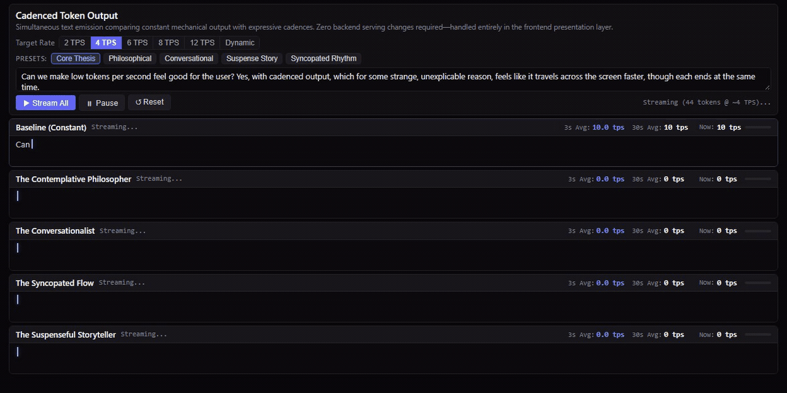

# Cadenced Token Output



> This is an experiment to see if low tokens per second can be made perceptually more pleasant.
>
> This approach is implemented entirely in the front-end presentation layer; no backend infra needs to be touched.

---

## Cadence Profiles

All cadences operate under a strict causal arrival floor ($d_i \ge a_i$) against a shared **Target Average Rate** (defaulting to 4 TPS). Punctuation and syntactic pauses naturally build a token buffer that fuels subsequent conversational bursts—running 100% causally in real time with zero artificial lookahead:

| Profile | Rhythm & Linguistic Dynamics | Perceptual Character |
| :--- | :--- | :--- |
| **Baseline (Constant)** | Flat, metronomic emission directly on server arrival (`1.0 × T`). | Robotic conveyor belt; feels slowest to the eye. |
| **The Contemplative Philosopher** | Connective syllable glide (`0.55 × T`), deliberate weight on multisyllabic words (`1.3 × T`), clause breath (`1.6 × T`), deep contemplative reflection at sentence end (`2.5 × T`). | Deeply thoughtful, cerebral, deliberate. |
| **The Conversationalist** | Breezy latching on short words (`0.45 × T`), natural conversational flow (`0.8 × T`), subtle thinking hesitation (`+0.35 × T`), casual sentence pause (`1.8 × T`). | Relaxed, spontaneous, warm, human. |
| **The Syncopated Flow** | Locked into 4-beat measures. Crisp sixteenth-note pocket (`0.48 × T`) slamming into an offbeat downbeat hold (`1.1 × T`), with musical rest at bar end (`1.8 × T`). | Rhythmic, musical, tight, energetic. |
| **The Suspenseful Storyteller** | Creeping, cautious drip (`1.15 × T`) accelerating into sudden narrative rushes (`0.4 × T`) on action verbs, broken by dramatic cliffhangers (`1.8 × T`) and deep breath-holding silences (`2.8 × T`). | Gripping, atmospheric, dramatic. |

---

### Run Locally
The app is entirely self-contained in clean HTML5, CSS3, and modern vanilla JavaScript:

```bash
# Clone the repository
git clone https://github.com/EldarMu/CadencedTokenOutput.git
cd CadencedTokenOutput

# Start a local web server
python -m http.server 8080
```
Open **`http://localhost:8080/index.html`** in your browser.


## License
MIT License. If your frontier lab ends up adopting this, you might as well toss me an interview.
